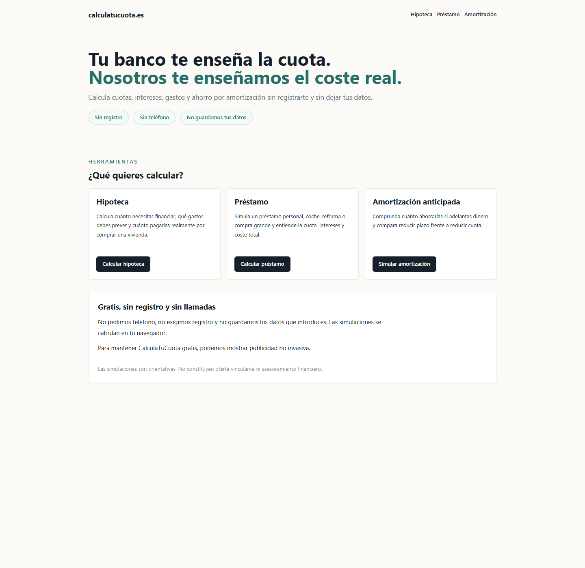
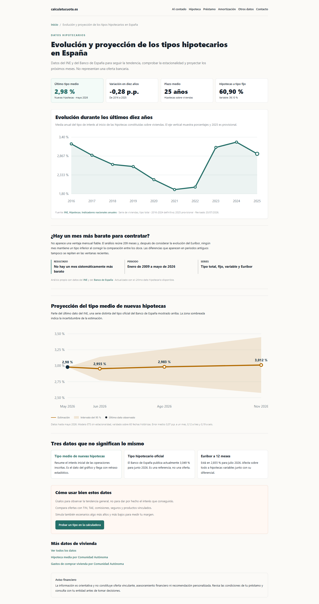

# calculatucuota.es

Herramienta financiera web para simular hipotecas, préstamos personales y amortización anticipada, y consultar la evolución del mercado hipotecario español con datos oficiales.

---

## Demo

Web publicada:

**https://calculatucuota.es**

### Vista rápida

  

---

## Resumen

**calculatucuota.es** nace para resolver un problema sencillo: muchas calculadoras financieras enseñan una cuota, pero no explican bien el coste real de una operación.

La herramienta permite simular de forma rápida:

- hipotecas;
- préstamos personales;
- amortización anticipada;
- comparación entre reducir plazo y reducir cuota;
- seguimiento del tipo hipotecario medio y del Euríbor;
- análisis de si existe un mes sistemáticamente más barato para contratar una hipoteca;
- informes descargables en PDF;
- imagen compartible;
- resumen en texto para copiar y enviar.

El objetivo es que cualquier usuario pueda entender:

- cuánto necesita financiar;
- cuánto pagará al mes;
- cuánto terminará pagando;
- cuánto se va en intereses;
- qué ocurre si amortiza antes;
- qué ahorro real puede conseguir.

---

## Stack técnico

| Área | Tecnología |
|---|---|
| Framework | Astro |
| UI | React |
| Lenguaje | TypeScript |
| Estilos | Tailwind CSS |
| Testing | Vitest |
| Build | Static build |
| Deploy | Vercel |
| Dominio | calculatucuota.es |
| Datos públicos | INE y Banco de España |

---

## Features principales

### Calculadora de hipoteca

- Cálculo de cuota mensual.
- Estimación de gastos de compra.
- Separación clara entre ahorros, entrada y gastos.
- Tipo medio orientativo editable.
- Cálculo de intereses totales.
- Comparativa de amortización anticipada.
- Comparación entre reducir plazo y reducir cuota.
- PDF visual descargable.
- Imagen compartible.

### Calculadora de préstamo personal

- Cálculo de importe a financiar.
- Entrada o aportación inicial.
- Finalidad del préstamo.
- Comisión de apertura.
- Costes vinculados mensuales.
- Coste total estimado.
- Simulación de amortización extra.
- Informe PDF y resumen compartible.

### Simulador de amortización anticipada

- Capital pendiente.
- Cuota mensual actual.
- TIN.
- Plazo restante.
- Amortización mensual, anual o puntual.
- Inicio desde ahora o diferido.
- Comparativa entre reducir plazo y reducir cuota.
- Avisos cuando los datos introducidos no son coherentes.
- Salida compartible en PDF, imagen y texto.

### Evolución del tipo hipotecario medio

- Último tipo hipotecario medio publicado por el INE.
- Último Euríbor a 12 meses publicado por el Banco de España.
- Evolución histórica de ambas series.
- Comparación entre hipotecas a tipo fijo y variable.
- Análisis estadístico de la estacionalidad mensual.
- Escenario estadístico a 1, 3 y 6 meses con intervalos de incertidumbre y error histórico.
- Actualización periódica a partir de fuentes oficiales.

El análisis concluye que, una vez considerada la evolución general de los tipos,
no existe un mes sistemáticamente más barato en el periodo reciente. La página
también publica una primera previsión experimental, diferenciada de los datos
observados y de las ofertas bancarias.

  

---

## Privacidad

La herramienta está pensada para funcionar sin fricción:

- no requiere registro;
- no pide email;
- no guarda datos personales;
- no utiliza base de datos para las simulaciones;
- los cálculos se realizan en el navegador;
- los resultados son orientativos.

---

## Arquitectura resumida

El proyecto está construido como una aplicación estática desplegada en Vercel.

La lógica financiera está separada en módulos reutilizables para:

- cálculo de cuota;
- generación de amortización;
- comparación de escenarios;
- simulación de amortización anticipada;
- preparación de datos para PDF;
- preparación de imagen compartible;
- generación de resumen copiable.

La interfaz se organiza en páginas independientes:

| Ruta | Descripción |
|---|---|
| `/` | Página principal |
| `/calculadora-hipoteca` | Simulador de hipoteca |
| `/calculadora-prestamo-personal` | Simulador de préstamo personal |
| `/simulador-amortizacion` | Simulador de amortización anticipada |
| `/reducir-cuota-o-plazo` | Explicación y acceso a comparativa |
| `/evolucion-tipo-medio-hipotecas` | Datos actuales, evolución histórica y análisis de estacionalidad |

---

## Seguridad

El código fuente principal es privado.

Este repositorio es únicamente una presentación pública del proyecto. No contiene:

- código fuente de la aplicación;
- claves;
- tokens;
- variables de entorno;
- configuración sensible;
- endpoints privados;
- datos de usuarios.

---

## Estado del proyecto

Proyecto finalizado y publicado.

La aplicación combina simuladores financieros con información pública del mercado hipotecario para que el usuario pueda entender una financiación antes de hablar con un banco o comparar ofertas.

---

## Mantenimiento

El desarrollo funcional está cerrado. El mantenimiento posterior se limita a:

- actualizar los datos oficiales cuando se publique un nuevo periodo;
- acumular un historial público de previsiones y resultados observados;
- enviar y mantener el sitemap en Google Search Console;
- trabajar el posicionamiento SEO según las consultas reales de búsqueda.

---

## Autor

Proyecto creado por **JorgeBaGa**.

GitHub: [@JorgeBaGa](https://github.com/JorgeBaGa)

---

## Nota sobre el código fuente

Este repositorio es solo un showcase público.

El código fuente de **calculatucuota.es** se mantiene en un repositorio privado por motivos de seguridad, mantenimiento y control del producto.

**calculatucuota.es no constituye una oferta vinculante ni asesoramiento financiero. Los resultados son simulaciones orientativas.**
